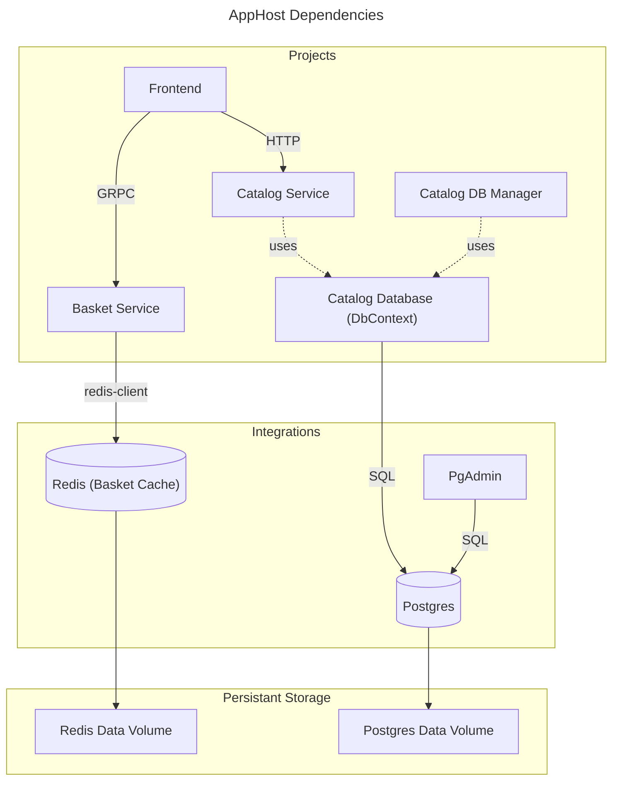

# .NET Aspire Shop

Open the solution at
```shell
aspire-samples/samples/AspireShop/AspireShop.sln
```

Start the application using the `https` profile in `debug` mode.

When everything is running you should have the dashboard up with all resources in a `Running` state.

## Solution overview

If we take a look at the project dependencies we see that everything is dependent on the `ServiceDefaults` and nothing on the `AppHost`, as we expect


But this does not give us the whole picture. The Integrations are not included. Let's take a look in the `Program.cs` in `AppHost`. Here we see this dependency tree, witch is arguably more useful.



## Explore the shop

Add some items to the basket and try to check out using the shopping cart icon.

In the `AspireShop.Frontend/Components/Cart.razor` we can see that clicking the icon triggers the `HandleCheckout` method, that runs the `CheckoutBasketAsync` method on the service, that runs `CheckoutBasketAsync` on the client.

In the `AspireShop.BasketService/BasketService.cs` we can see the implementation for the `CheckoutBasket` method.

---

Next we will expand the shop.

